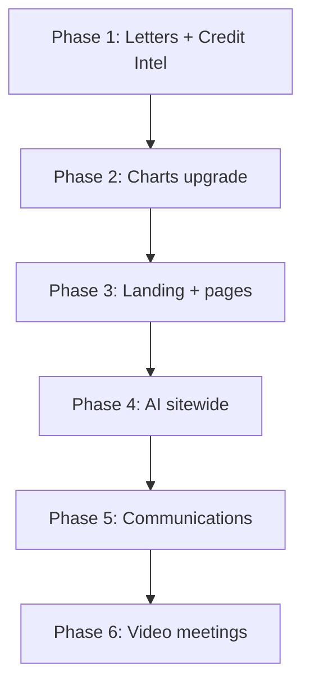

# Complete Plan: Charts, Landing, AI, Communications, Video

## Current State Summary

**Letters + Credit Intel (already done):**

- Screenshot mismatch warning in LettersCommandCenter when `scoreEvidenceForAccount < 0.4`
- Public Records tab in CreditIntelTabs (conditional on `hasPublicRecords || hasBankruptcy`)
- Download reasons library in LettersCommandCenter + CreditIntelTabs
- Business Sequence Ladder expanded to 20 sections; TOC in PDF when 5+ sections

**Charts today:** [TimeSeriesAreaChart](src/components/ui/TimeSeriesAreaChart.tsx) (Recharts AreaChart), [SimpleAreaChart](src/components/FinelyComponents.jsx) (basic SVG), [DonutChart](src/components/FinelyComponents.jsx) (simple SVG). Used in AdminDashboardPage, PortalSteps.

**Landing:** [src/components/landing/index.tsx](src/components/landing/index.tsx) (~2000 lines) — hero with phone mockup, credit cards, features, testimonials.

**AI:** [callAiGateway](src/lib/aiClient.ts) via Supabase Edge Function. Used in LettersCommandCenter (AI draft), PortalChatWidget, PartnerMessagesPage, AdminLeadIntelPage, AdminOpsAgentPage, Media Studio, Course Editor.

**Communications:** [PartnerMessagesPage](src/pages/portal/PartnerMessagesPage.tsx) — threads, Tenor GIFs, [EMOJI_LIST](src/components/chat/emojiData.ts) (~300 emojis). [PortalChatWidget](src/components/chat/PortalChatWidget.tsx) — AI coach. No video meeting (only external meeting URL).

---

## Phase 1 — Letters + Credit Intel (verify and fill gaps)

**1.1 Letters audit**

- Confirm screenshot mismatch warning renders in focused-item Evidence panel
- Confirm Download reasons library in Disputes tab and Letters header
- Ensure `getDisputeReasonsLibraryAsText` covers all categories

**1.2 Credit Intel audit**

- Confirm Public Records tab shows when `hasPublicRecords || hasBankruptcy`
- Confirm Download reasons library in Disputes tab
- Verify tab ordering and layout

**Deliverables:** Any small fixes; otherwise mark complete.

---

## Phase 2 — Charts and graphs upgrade

**2.1 New chart components (Recharts-based, premium styling)**

- **BarChartCard** — grouped/stacked bars, glass card, gradient fills, hover tooltips
- **LineChartCard** — multi-series lines with smooth curves
- **DonutChartCard** — ring with center stat, optional legend
- **ComposedChartCard** — area + line combinations
- **Sparkline** — inline mini-chart for KPI cards

**2.2 Styling standards**

- Glass borders (`border-white/10`, `backdrop-blur-xl`)
- Gradient fills (amber/emerald/violet palette)
- Smooth animations (`transition-all duration-300`)
- Responsive tooltips with dark theme
- Grid/crosshair styling for readability

**2.3 Adoption**

- [AdminDashboardPage](src/pages/admin/AdminDashboardPage.tsx): enhance 14-day chart, add KPI sparklines
- [AdminAnalyticsPage](src/pages/admin/AdminAnalyticsPage.tsx): add real chart visualizations (revenue, conversions, funnel)
- [PartnerDashboardPage](src/pages/portal/PartnerDashboardPage.tsx): score trend, readiness over time
- [PartnerBillingPage](src/pages/portal/PartnerBillingPage.tsx): payment/usage charts
- [PortalSteps](src/components/PortalSteps.jsx) / [FinelyComponents](src/components/FinelyComponents.jsx): replace SimpleAreaChart/DonutChart with new components

**2.4 Shared chart library**

- Create `src/components/charts/` with reusable, configurable chart wrappers
- Export from `src/components/ui/index.tsx`

---

## Phase 3 — Landing page and key pages upgrade

**3.1 Landing page ([src/components/landing/index.tsx](src/components/landing/index.tsx))**

- Hero: stronger typography, clearer value prop, animated gradient backgrounds
- Sections: better spacing, card hierarchy, micro-interactions
- CTAs: more prominent, better contrast
- Social proof: testimonial cards, logos, trust badges
- Mobile: improved breakpoints and touch targets

**3.2 Other key pages**

- [PricingPage](src/pages/PricingPage.tsx): clearer tiers, feature comparison
- [ResourcesPage](src/pages/ResourcesPage.tsx): card grid, filters
- [FaqPage](src/pages/FaqPage.tsx): accordion styling
- [TestimonialsPage](src/pages/TestimonialsPage.tsx): grid layout
- [PersonalCreditPage](src/pages/PersonalCreditPage.tsx): journey visualization
- [ContactPage](src/pages/ContactPage.tsx): form layout

---

## Phase 4 — AI enhancement sitewide

**4.1 PortalChatWidget**

- Richer system prompt, context injection (partner stage, next actions)
- Suggested prompts / quick actions
- Typing indicator, error recovery

**4.2 Letters AI draft**

- Improve prompts for opening + per-item narratives
- Add “improve tone” / “shorten” quick actions

**4.3 Lead intel**

- Enrich [AdminLeadIntelPage](src/pages/admin/AdminLeadIntelPage.tsx) with AI summaries, next-best-action

**4.4 Ops agent**

- [AdminOpsAgentPage](src/pages/admin/AdminOpsAgentPage.tsx): daily summary, prioritized queue

**4.5 Doc intel**

- [docIntel/processUploadedDocument](src/docIntel/processUploadedDocument.ts): AI extraction enhancements

**4.6 Feature flag + settings**

- Centralize AI settings, provider selection, model hints

---

## Phase 5 — Communications upgrade

**5.1 Emojis (500+)**

- Expand [emojiData.ts](src/components/chat/emojiData.ts) with additional categories (symbols, flags, activities, objects, etc.)
- Add emoji picker with search and categories

**5.2 GIFs**

- Tenor already integrated in [PartnerMessagesPage](src/pages/portal/PartnerMessagesPage.tsx)
- Add trending, favorites, recent
- Improve picker UI (grid, preview on hover)

**5.3 Text features**

- Bold, italic, strikethrough in message composer
- Mentions (`@partner`, `@agent`)
- Reactions on messages (emoji quick-reacts)
- Link previews
- Code snippets

**5.4 Email enhancement**

- [commsEngine](src/lib/commsEngine.ts), [commsDeliveryClient](src/lib/commsDeliveryClient.ts): template variables, scheduling placeholder
- Admin Comms Studio: bulk send, segments

---

## Phase 6 — Video meeting features

**6.1 Meeting model**

- Extend [CalendarEvent](src/domain/calendar.ts): `meetingProvider` (`zoom`|`meet`|`custom`|`webrtc`), `meetingRoomId`, `recordingUrl`
- Store meeting metadata for join flows

**6.2 Meeting scheduler UI**

- In [AdminCalendarPage](src/pages/admin/AdminCalendarPage.tsx): provider dropdown (Zoom / Google Meet / Custom URL)
- Optional: placeholder for future “Create meeting” (Zoom/Meet API integration)
- For now: improved external URL input, copy link, join button

**6.3 Partner Calendar**

- [PartnerCalendarPage](src/pages/portal/PartnerCalendarPage.tsx): prominent “Join meeting” when `meetingUrl` present
- Countdown to meeting start
- Add to calendar (.ics) improved

**6.4 Video meeting options (configurable)**

- Settings: default provider, optional API keys (future)
- Admin: recording URL field for post-meeting

---

## Execution order

1. **Phase 1** — Letters + Credit Intel (verify, fix gaps)
2. **Phase 2** — Charts (new components, then adoption)
3. **Phase 3** — Landing + key pages
4. **Phase 4** — AI enhancement
5. **Phase 5** — Communications (emoji, GIF, text)
6. **Phase 6** — Video meetings

---

## File touchpoints

| Area         | Primary files                                                                               |
| ------------ | ------------------------------------------------------------------------------------------- |
| Letters      | `LettersCommandCenter.tsx`, `lettersCommandCenterDraftRepo.ts`                              |
| Credit Intel | `CreditIntelTabs.tsx`, `disputeReasons.ts`                                                  |
| Charts       | `TimeSeriesAreaChart.tsx`, `FinelyComponents.jsx`, new `components/charts/`                 |
| Landing      | `landing/index.tsx`                                                                         |
| AI           | `aiClient.ts`, `PortalChatWidget.tsx`, `LettersCommandCenter.tsx`, `AdminLeadIntelPage.tsx` |
| Comms        | `emojiData.ts`, `PartnerMessagesPage.tsx`, `tenorClient.ts`, `commsEngine.ts`               |
| Video        | `calendar.ts`, `AdminCalendarPage.tsx`, `PartnerCalendarPage.tsx`                           |

