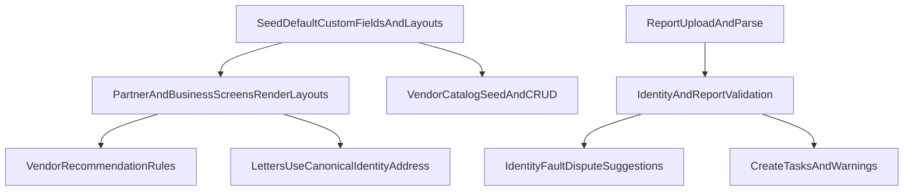

# Enterprise profiles, vendors, tradelines clarity + upload validation plan

## How this fits with the current roadmap

- This plan is an **add-on track** to the letter/analysis/pricing plan you already approved directionally (`premium_letter_studio_pricing_and_analysis_8d724705.plan.md`).
- Goal here: fix the “I can’t function at enterprise level” gap by making **data capture + recommendations** robust across Projects/Tasks, Personal/Business profiles, Vendors, and Credit Report parsing.

## Decisions locked (from you)

- **Fields implementation**: Use **tenant-scoped Custom Fields + Field Layouts** (so you can keep adding without code).
- **Vendors**: **Admin-managed** catalog, but shipped with a **large seeded starter list**; recommendations select from that catalog.

## Outcomes

- **20+ default fields** are pre-created (seeded) for key scopes: `partners`, `projects`, `tasks` (and business-specific sections stored under partner as well).
- The **Business portal** becomes actionable:
  - Profile is robust (fundability + compliance + accounts + credentials + identifiers).
  - Vendors shows Tier 1/2/3 lists with **unlock rules** and **recommended picks**.
  - Billion Path becomes more data-driven (ties into vendor + docs + relationships).
- **Tradelines UI** clearly separates what’s what:
  - Strong “Responsibility” badges (Authorized User vs Individual/Joint/etc.).
  - Better headings + larger “direction” copy that pops.
- **Credit report upload validation**:
  - Detects “different report” vs “same partner” uploads.
  - Flags **name mismatch** and **identity/address faults**.
  - Surfaces faults as dispute suggestions (where appropriate) and feeds the case/letter flow.
- **Partner address auto-fills in letters** (name + address + city/state/zip) consistently.

## What we already have (good news)

- **Custom field definitions + per-tenant layouts** already exist in Admin Settings (`src/pages/admin/AdminSettingsPage.tsx`) and renderer exists (`src/components/fields/FieldLayoutRenderer.tsx`).
- **Credit Analysis Report generation already exists** on `/portal/reports` and saves into the Vault as a PDF (`src/pages/portal/PartnerReportsPage.tsx` calls `generateCreditAnalysisReportPdf`). We’ll expand/structure this (not reinvent it).

## Phase A — Seed “enterprise default fields” automatically (so you don’t have to)

- Add a **seed initializer** that runs once per tenant and creates:
  - Custom field definitions for the scopes you care about.
  - A sane Field Layout grouping into sections (Identity, Contact, Address, Credit Monitoring, Business IDs, Compliance, Notes, etc.).
- Target scopes:
  - **Partners**: identity + address + contact + monitoring logins + IDs (DUNS/EIN/Secretary of State) + document links + notes.
  - **Projects**: goals, funding target bands, stage, blockers, assigned roles, SLA dates.
  - **Tasks**: category, owner, due windows, dependencies, channel, “proof needed”, escalation, etc.
- Files likely involved:
  - `src/data/customFieldsRepo.ts`, `src/data/fieldLayoutsRepo.ts`
  - `src/pages/admin/AdminSettingsPage.tsx` (to show seeded fields cleanly)
  - `src/data/customFieldValuesRepo.ts` (values)

## Phase B — Render those fields everywhere you need them (not only in Settings)

- Upgrade screens to use `FieldLayoutRenderer` so you can edit values on-record:
  - Partner profile screens (Portal + Admin detail)
  - Projects and Tasks UI (Portal)
  - Business Profile (Business portal)
- Primary targets:
  - `src/pages/portal/PartnerProjectsPage.tsx`
  - `src/pages/portal/PartnerTasksPage.tsx`
  - `src/pages/business/BusinessProfilePage.tsx`

## Phase C — Admin-managed Vendor Catalog + recommendation engine

- Build a **Vendor Catalog** entity with:
  - tier (1/2/3), categories (net30/office/shipping/marketing/fuel/etc.), bureau-reporting expectations (tag), url, notes, requirements, “stage eligibility”.
  - “locked” vs “unlocked” link behavior (show vendor card always, unlock CTA when eligible).
- Provide:
  - **Seeded starter list** (30+ Tier 1, plus Tier 2/3 starters) with tags.
  - **Recommendation rules** that choose from the catalog using partner/business profile signals (stage, industry, state, docs readiness, etc.).
- UI:
  - `src/pages/business/BusinessVendorsPage.tsx`: show Tier cards + Recommended section + full catalog per tier.
  - New admin UI (likely under Admin Settings or a new Admin page): CRUD vendors + edit rules.

## Phase D — Tradelines clarity + typography pass

- Improve “Tradelines page” distinctions:
  - In `src/components/reports/ParsedReportViewer.tsx`, prominently surface:
    - Responsibility badge (e.g., **Authorized User**)
    - Account type grouping and status clarity
    - Any “bundle” or special grouping with a dedicated label chip
  - Increase readability:
    - Replace ultra-small `text-[10px]` in key instructional/section headers with slightly larger, higher-contrast typography where it matters.
    - Ensure directions are in callout cards (premium) rather than faint subtitles.
- Also remove remaining nested vertical scrollers that reintroduce the “site within a site” feel (notably still present in `PartnerTasksPage` completed/activity sections).

## Phase E — Smarter credit report upload validation + identity fault surfacing

- On upload/parse (`src/components/reports/ReportUploader.tsx` + parsing pipeline):
  - Extract consumer identity from the parsed report (name/address/possible SSN last4 where available).
  - Compare against partner canonical identity (from custom field values and/or partner profile).
  - Show a clear “Mismatch detected” panel with actionable fixes:
    - Update profile fields
    - Mark as “Different person/report” (don’t attach to this partner)
  - Convert mismatches into:
    - Dispute candidates (where appropriate)
    - Tasks (e.g., “Verify address consistency across bureaus”).

## Data model note (address auto-fill for letters)

- Define a canonical identity object we can reliably read for letter headers.
  - If custom fields exist (address city/state/zip), we **sync** them into canonical identity or read them through a helper so letters always get the correct mailing block.

## Diagram (high level)

