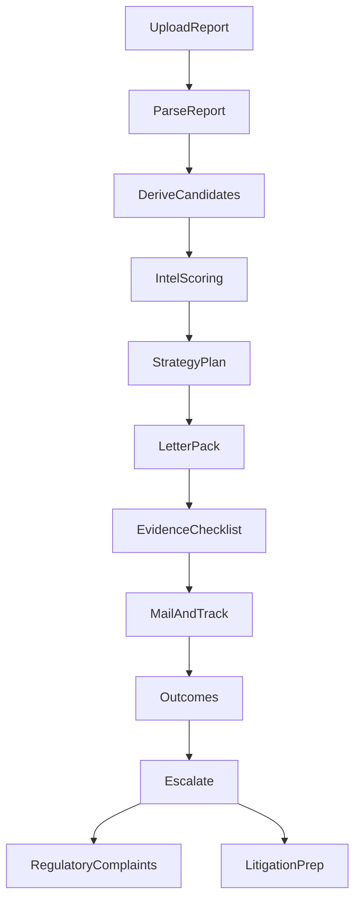
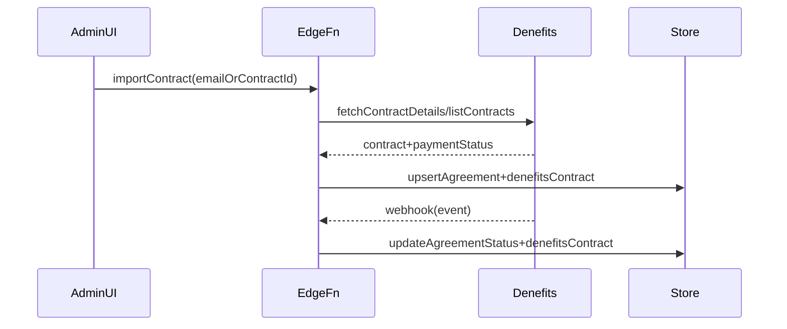

## Goals

- Make the platform production-grade for real client work by prioritizing:
  - **Credit Intelligence**: dramatically more advanced insights, scoring, simulations, and next-step strategy.
  - **Litigation-focused letters & workflows**: affidavits, summons/answers, advanced dispute and escalations, and regulatory complaint packs with actionable next steps.
- Expand Denefits to support **existing clients** (import/link) and give admins **contract analytics**.
- Modernize analytics visuals (charts/imagery) and remove “empty/limited” fields by introducing stronger schemas and richer inputs.
- Add **40+ automations** with conditions/actions and strong auditability.
- Add **extensive settings + permissions + white label** so you can control everything per tenant/partner/admin.

## Current codebase anchors (what we’ll extend)

- **Credit Intel**: `[src/creditReports/creditIntelInsights.ts](C:\Users\stlou\.cursor\worktrees\Finely-Cred\mpy\src\creditReports\creditIntelInsights.ts)`, `[src/components/creditIntel/CreditIntelTabs.tsx](C:\Users\stlou\.cursor\worktrees\Finely-Cred\mpy\src\components\creditIntel\CreditIntelTabs.tsx)`
- **Templates/letters**: `[src/templates/bases/starterPack.ts](C:\Users\stlou\.cursor\worktrees\Finely-Cred\mpy\src\templates\bases\starterPack.ts)`, `[src/templates/render.ts](C:\Users\stlou\.cursor\worktrees\Finely-Cred\mpy\src\templates\render.ts)`, `[src/letters/generateDisputePdfInline.ts](C:\Users\stlou\.cursor\worktrees\Finely-Cred\mpy\src\letters\generateDisputePdfInline.ts)`
- **Escalations (internal today)**: `[src/pages/portal/PartnerEscalationsPage.tsx](C:\Users\stlou\.cursor\worktrees\Finely-Cred\mpy\src\pages\portal\PartnerEscalationsPage.tsx)`
- **Automations (2 workflows today)**: `[src/domain/automation.ts](C:\Users\stlou\.cursor\worktrees\Finely-Cred\mpy\src\domain\automation.ts)`, `[src/automation/runWorkflows.ts](C:\Users\stlou\.cursor\worktrees\Finely-Cred\mpy\src\automation\runWorkflows.ts)`, UI embedded in `[src/components/dashboard/index.tsx](C:\Users\stlou\.cursor\worktrees\Finely-Cred\mpy\src\components\dashboard\index.tsx)`
- **Settings**: `[src/domain/settings.ts](C:\Users\stlou\.cursor\worktrees\Finely-Cred\mpy\src\domain\settings.ts)`, `[src/data/settingsRepo.ts](C:\Users\stlou\.cursor\worktrees\Finely-Cred\mpy\src\data\settingsRepo.ts)`
- **Denefits client** (currently browser-based; needs secure backend for production): `[src/lib/denefitsApi.ts](C:\Users\stlou\.cursor\worktrees\Finely-Cred\mpy\src\lib\denefitsApi.ts)`

## High-level architecture additions

### Credit-to-litigation workflow (new “case-first” pipeline)

### Denefits secure integration (easiest + production-safe)

- **Recommended**: Supabase Edge Functions as backend for Denefits API calls + webhook receiver.
- Phase 1 uses **manual import/linking** (fastest) + optional “bulk sync” later.

## Phased build plan (what “launch-ready” becomes)

### Phase A (Immediate) — Credit Intelligence “40x” expansion (primary)

- **Data model upgrades**
  - Add richer intel entities (without storing sensitive PII) for:
    - contradictions, furnishers, compliance flags, statute timelines, and escalation readiness.
  - Keep as derived outputs from parsed report + case history to avoid manual data entry.
- **Scoring/Insights engine**
  - Extend `creditIntelInsights.ts` with:
    - multi-factor scoring: recency, severity, bureau inconsistency, furnisher behavior, dispute history, evidence strength.
    - “what to do next” strategy generator: recommended dispute type, evidence gaps, deadlines, escalation triggers.
    - simulations: utilization changes, deletions, aging impact (clearly labeled as estimate).
- **UI upgrades**
  - Expand `CreditIntelTabs.tsx` to include:
    - “Litigation readiness” tab: violations checklist, missing evidence, timeline.
    - “Strategy timeline” view: rounds, follow-ups, escalation thresholds.
    - clearer CTA wiring into Letters/Complaints modules.

### Phase B — Litigation-focused templates + complaint workflows (primary)

- **Template catalog expansion**
  - Extend categories in `[src/domain/templates.ts](C:\Users\stlou\.cursor\worktrees\Finely-Cred\mpy\src\domain\templates.ts)` to include:
    - `regulatory_complaint`, `litigation_demand`, `arbitration_demand`, `affidavit`, `summons_response`
  - Add many new template bases under `[src/templates/bases/](C:\Users\stlou\.cursor\worktrees\Finely-Cred\mpy\src\templates\bases)` (new files, keep `starterPack.ts` but split by domain):
    - credit disputes: advanced FCRA 609/611/623 variants, MOV follow-ups, reinvestigation failures
    - repossession/foreclosure: dispute narratives + documentation requests (TILA/UCC concepts as “alleged violations” with placeholders)
    - bankruptcy/public records handling
    - affidavits: identity theft, non-liability, facts declaration
    - debt/summons: answers, discovery requests, meet-and-confer, arbitration election templates
    - regulator packs: CFPB/AG/FTC/BBB complaint letter + “submission checklist” cover page
- **New complaint tracker module**
  - Add domain + repo for `RegulatoryComplaint` records (draft/submitted/resolved) and link to evidence + cases.
  - Add partner UI page: create complaint draft, attach evidence, track status + follow-up tasks.
  - Add admin UI: view complaint pipeline across partners.

### Phase C — Make checklists modern and “flowy” (requested)

- Rebuild onboarding checklist page into a “guided flow” with:
  - progress timeline, cards with rich descriptions, and direct actions (Upload report, Add evidence, Generate letter pack, File complaint).
  - visible status on Partner Dashboard.
- Anchor: `[src/pages/portal/PartnerChecklistPage.tsx](C:\Users\stlou\.cursor\worktrees\Finely-Cred\mpy\src\pages\portal\PartnerChecklistPage.tsx)`

### Phase D — Denefits: existing-client import + admin analytics

- **Production-safe backend**
  - Add Supabase Edge Functions:
    - `denefits-import-contract`: input email/contractId → fetch details → upsert local agreement + denefits contract info
    - `denefits-webhook`: verify signature → update agreement/payment state
  - Stop using browser calls for live keys (keep browser mode only for local/demo).
- **Admin views**
  - Upgrade `AdminBillingPage` to show Denefits contract fields (status, remaining, totals, payment link, contract ID) and add filters.
  - Add “Denefits Analytics” section: totals, active contracts, MRR-like recurring totals, delinquency, cohort views.
- **Bulk sync (optional after manual import works)**
  - Pull `listContracts()` and present “match suggestions” (email/phone) with admin review.

### Phase E — Charts + imagery modernization (requested)

- **Charts**
  - Add a chart library (recommended `recharts`) and replace/augment current custom sparklines in `[src/components/ui/KpiCards.tsx](C:\Users\stlou\.cursor\worktrees\Finely-Cred\mpy\src\components\ui\KpiCards.tsx)`.
  - Add “real” dashboards with:
    - time-range toggles (14/30/90), tooltips, comparisons, anomaly markers.
- **Imagery**
  - Introduce a consistent imagery system:
    - hero illustrations per major page, section art for empty states, and visual guides for workflows.
    - image slots controlled by white label settings (Phase F).

### Phase F — Extensive settings + permissions + white label

- **RBAC/permissions**
  - Define roles (Admin, Ops, Agent, Partner, ReadOnly) + granular permissions per module (billing, templates, complaints, evidence, automations, settings).
  - Enforce in routing + page actions (not just hiding UI).
- **White label**
  - Tenant-level branding: logos, colors, typography tokens, custom domains (later), email templates (later), module toggles.
  - Admin UI becomes “control plane” with deep settings and sensible defaults.

### Phase G — Automations expansion (40+)

- Refactor current hardcoded workflows to a declarative engine:
  - Condition DSL (JSON) + evaluator
  - Action registry (create task, create letter draft, create complaint draft, notify, schedule follow-up)
  - Workflow templates library (seed with 40+ starting templates)
  - Run logs, audit trail, dry-run vs live
- Add “workflow builder” UI (optional) after the engine + templates are stable.

## Quality and launch gates

- No secrets in browser: Denefits live keys only via Edge Functions.
- Strong auditability: every automation, letter generation, complaint event, and Denefits event produces an immutable event log.
- “No empty fields” policy implemented via:
  - better defaults + placeholders
  - guided forms with progressive disclosure
  - template context validation with warnings (never blank letters silently).

## Deliverables sequence (recommended)

- First: Phase A + B (your priority for current client work).
- Then: Phase C (better execution UX).
- Then: Phase D (Denefits import + admin analytics).
- Then: Phase E/F/G (visual modernization + control plane + automations).

