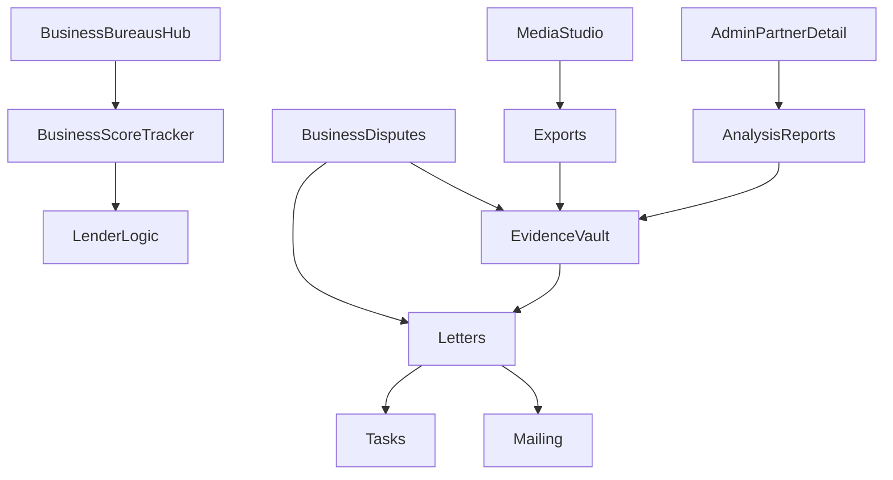

# Master plan: site + portal + admin overhaul (integrated)

## What’s already implemented (completed)

- **Mobile public nav + drawer responsiveness**: centered mobile header, tighter sizing, sectioned drawer.
- **Mailing upgrade**: autofill To/From, address verification via provider, in-modal PDF preview, richer statuses (`mail_pending`, `mail_failed`), admin + portal wiring.
- **CRM decongest + improvements**: KPI-first, collapsible sections, unified inbound tab, next-action editing, lead→partner follow-up task creation.

## Global product principles (applies to every area below)

- **Decongest by default**: KPI row first, then collapsible section cards (`
`), then a focused detail/editor panel.
- **Page-level scrolling** only (avoid tall nested scroll containers).
- **Premium list patterns**: grouped collapsible cards + sticky action bar; no dense tables on mobile.
- **Safety UX**: permissions-gated destructive actions; confirmation patterns.

## Phase 0 — Stabilize + unify navigation to new features

- Ensure new/expanded pages are reachable from the right nav rails and that routes are consistent across business/admin/portal.

## Phase 1 — Landing overhaul (drastic)

**Goal**: conversion-focused, premium, mobile-first, every section has its own “clean block”.

- Rebuild landing into a clear A→B narrative:
  - Hero (single primary CTA)
  - Proof/KPIs + testimonials preview
  - Services (premium cards)
  - How it works (3 steps)
  - Pricing/paths
  - FAQ teaser
  - Final CTA
- Collapse long copy with `
` so the page never becomes a wall of text.

**Primary files**

- `[src/App.tsx](src/App.tsx)`
- `[src/components/landing/](src/components/landing/)`

## Phase 2 — Analysis Reports (Admin generate + view hub)

**Goal**: Admin can generate from Partner Detail and immediately see/open/share the output in the same workflow area.

- Add a dedicated **Analysis Reports section** on Admin Partner Detail (near letters/workflow):
  - Cards: Open PDF, download, created date, variant/exhibits metadata.
  - Auto-highlight newest report after generation.
- Align admin generation options with the partner generation flow (variant/exhibits/templates) for consistency.
- Keep partner viewing consistent:
  - Portal Analysis Vault
  - Portal Letters Vault “Saved analysis reports”

**Primary files**

- `[src/pages/admin/PartnerDetailPage.tsx](src/pages/admin/PartnerDetailPage.tsx)`
- `[src/pages/portal/PartnerAnalysisVaultPage.tsx](src/pages/portal/PartnerAnalysisVaultPage.tsx)`
- `[src/pages/portal/PartnerLettersVaultPage.tsx](src/pages/portal/PartnerLettersVaultPage.tsx)`

## Phase 3 — Media Studio (drastic)

**Goal**: storyboard → scene editing → batch image generation → asset gallery → export, all sectioned and non-congested.

- Refactor Media Studio into clear sections (each its own card):
  - Project settings
  - Storyboard generator
  - Scene editor (duration/caption/prompt)
  - Batch generate images
  - Gallery (saved assets)
  - Export (WebM) + save
- Add strong progress/error UX and saved presets (brand style + aspect ratios).

**Primary files**

- `[src/pages/admin/AdminMediaStudioPage.tsx](src/pages/admin/AdminMediaStudioPage.tsx)`
- `[src/lib/imageGenClient.ts](src/lib/imageGenClient.ts)`
- `[src/lib/mediaExport.ts](src/lib/mediaExport.ts)`
- `[supabase/functions/image-generate/index.ts](supabase/functions/image-generate/index.ts)`
- `[supabase/functions/ai-gateway/index.ts](supabase/functions/ai-gateway/index.ts)`

## Phase 4 — Debt Center (drastic decongest)

**Goal**: take debt workflows from “long page” to A→Z clarity with KPIs, collapsible letters, and focused drafting.

- Add KPI rows and split detail page into collapsible section cards:
  - Case summary
  - Strategy dates
  - Recommended scenario
  - Letters (each spec is its own collapsible card)
  - Legal framework (collapsed)
- Introduce a focused draft panel (right column desktop / slide-over mobile).
- Keep mailing centralized in Letters Vault, but make “Next step: mail from vault” explicit.

**Primary files**

- `[src/pages/portal/PartnerDebtPage.tsx](src/pages/portal/PartnerDebtPage.tsx)`
- `[src/pages/portal/PartnerDebtDetailPage.tsx](src/pages/portal/PartnerDebtDetailPage.tsx)`
- `[src/legal/debtLetterTemplates.ts](src/legal/debtLetterTemplates.ts)`

## Phase 5 — Business Portal: A→Z guided business credit (drastic)

**Goal**: guided steps + guided knowledge across the whole process, from setup → bureaus → vendors → funding applications.

### 5A) A→Z wizard + page-level guided checklists (both)

- Add an A→Z “Business Credit Roadmap” wizard with progress tracking.
- Add page-level checklists with expandable “what to do / what not to do / why underwriters care”:
  - address consistency
  - 411 listing
  - 1-800 number + phone hygiene
  - domain/email consistency
  - entity + EIN readiness
  - “10 employees” and other underwriting optics guidance
  - consistent data across all bureaus

### 5B) Business bureaus + scores hub

- Add `/business/bureaus` hub explaining:
  - D&B vs Experian Business vs Equifax Business
  - which bureau to focus on by goal
  - scores and how to improve (including paid score factors and “reported payments” counters)

### 5C) Business score tracker (manual now)

- Add manual score snapshots by bureau + counters:
  - score value/type
  - last updated date
  - reporting tradelines
  - reported paid payments
  - derog flags

### 5D) Business-bureau disputes (manual-first, reusable infra)

- Add `/business/disputes` and `/business/disputes/:id`:
  - create “negative items” manually
  - select items to dispute
  - attach evidence
  - generate PDFs
  - mail from vault
  - create follow-up tasks
- Introduce domain-aware bureau model so consumer disputes remain stable.

**Primary files / new modules**

- Business pages:
  - `[src/pages/business/BusinessDashboardPage.tsx](src/pages/business/BusinessDashboardPage.tsx)`
  - `[src/pages/business/BusinessProfilePage.tsx](src/pages/business/BusinessProfilePage.tsx)`
  - `[src/pages/business/BusinessFundingPage.tsx](src/pages/business/BusinessFundingPage.tsx)`
  - New: `src/pages/business/BusinessBureausPage.tsx`
  - New: `src/pages/business/BusinessDisputesPage.tsx`, `src/pages/business/BusinessDisputeDetailPage.tsx`
- Domain/data:
  - New: `src/domain/businessCredit.ts`, `src/data/businessCreditRepo.ts` (local-first)
  - Bureau abstraction: extend `[src/domain/creditReports.ts](src/domain/creditReports.ts)` or add `src/domain/bureaus.ts`
  - Domain-aware addresses: new `src/letters/bureauAddresses.ts`
  - Update default recipient logic in `[src/components/letters/MailLetterModal.tsx](src/components/letters/MailLetterModal.tsx)` to use the new address registry

## Phase 6 — Lender Logic Engine: 10+ recommendations + local (ZIP + 50 miles)

**Goal**: at least 10 lender recommendations, emphasizing local banks/credit unions with high approval/high limits, and relationship/no-doc leaning.

- Extend lender list from 4 → 10+ and add filtering:
  - category: national vs credit_union vs local
- Add inputs:
  - ZIP code
  - radius (fixed default 50 miles)
  - relationship toggles (existing relationship, willing to open deposits)
  - no-doc preference
- Hybrid data sourcing:
  - curated “top picks” list
  - optional lookup using public institution datasets (FDIC/NCUA) for nearby options

**Primary files**

- `[src/components/dashboard/index.tsx](src/components/dashboard/index.tsx)` (`LenderLogicEngine`)
- `[src/pages/business/BusinessFundingPage.tsx](src/pages/business/BusinessFundingPage.tsx)`
- New: `src/data/localLenders.ts` (curated list) + optional lookup module

## Phase 7 — Tasks/Projects expansion + team assignment

**Goal**: many more task fields/features/options, more project/task power, and admin can assign tasks to team members.

### Assignment rules

- **Default**: partners cannot assign tasks.
- **Exception**: partners can assign only when a **hybrid entitlement/plan** is enabled (explicit feature gate).

### Task upgrades (additive, backward-compatible)

- Extend `TaskItem` to support:
  - multi-assignee `assigneeUserIds`
  - checklist items
  - status history
  - richer tags/priority UX
  - comments (new domain + repo)
  - attachments (reuse evidence IDs; optional expansion)
- Update UIs:
  - Portal tasks pages show assignees, checklists, comments.
  - Admin workflow queue filters by assignee.
  - Admin task creator includes team assignee picker using tenant memberships.

**Primary files**

- `[src/domain/tasks.ts](src/domain/tasks.ts)`
- `[src/data/tasksRepo.ts](src/data/tasksRepo.ts)`
- New: `src/domain/taskComments.ts`, `src/data/taskCommentsRepo.ts`
- Membership/team:
  - `[src/domain/tenants.ts](src/domain/tenants.ts)`
  - `[src/data/tenantsRepo.ts](src/data/tenantsRepo.ts)`
- UI pages:
  - `[src/pages/portal/PartnerTasksPage.tsx](src/pages/portal/PartnerTasksPage.tsx)`
  - `[src/pages/portal/PartnerProjectsPage.tsx](src/pages/portal/PartnerProjectsPage.tsx)`
  - `[src/pages/admin/AdminWorkflowQueuePage.tsx](src/pages/admin/AdminWorkflowQueuePage.tsx)`
  - `[src/pages/admin/AdminTaskCreatorPage.tsx](src/pages/admin/AdminTaskCreatorPage.tsx)`

## Phase 8 — Site-wide “decongest” audit and refactor sweep

**Goal**: find all congested sections and refactor systematically.

- Audit target pages (public, portal, admin, business) for:
  - dense tables on mobile
  - nested scroll containers
  - long unsectioned copy
  - scattered actions
- Apply the global patterns:
  - KPI row
  - collapsible grouped cards
  - focused edit panel
  - sticky action bar

## High-level architecture diagram

## Acceptance/test checklist

- Mobile UX: no oversize nav/menu, no horizontal scroll tables.
- Business portal: A→Z guidance is visible and actionable.
- Lender logic: shows 10+ results and supports ZIP + 50-mile radius.
- Admin analysis reports: generated outputs are immediately viewable on Partner Detail.
- Tasks/team: admin can assign to tenant members; partners cannot unless hybrid entitlement.

