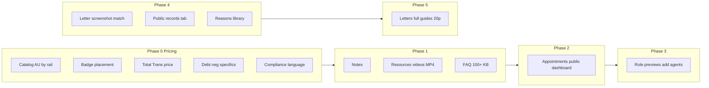

# Pricing, Letters, FAQ, Appointments & Deliverables — Full Scope Plan

This plan adds your requests to the existing **post-master stabilization** work and organizes them into phases. It touches pricing catalog, UI components, Resources, Calendar, FAQ/Knowledge Base, role dashboards, Credit Intel, Letters/Evidence, dispute reasons, guides/PDFs, and compliance language.

---

## Phase 0: Pricing & Bundles (catalog + site-wide copy)

**1. Funding Accelerator Bundle — 1 AU for Stripe only**

- In [src/config/pricingCatalog.ts](src/config/pricingCatalog.ts), the bundle `bundle_funding_accelerator` currently describes "2 Authorized User placements" and has entitlements `tradeline_starter` + `tradeline_boost`.
- Add **rail-specific** behavior: for **Stripe** only, the bundle includes **1 AU** (e.g. one entitlement or a new package variant); for **Denefits** (`in_house`), keep 2 AUs as today.
- Implementation options: (A) add optional `stripeOnlyHighlights` / `inHouseHighlights` and `stripeEntitlementKeys` vs `inHouseEntitlementKeys` on packages, or (B) a separate package id for "Funding Accelerator (Stripe)" with 1 AU. Recommend (A) to avoid duplicate cards.
- Update tagline/highlights in catalog so Stripe card shows "1 AU" and Denefits card shows "2 AUs"; ensure checkout/entitlement grant uses the correct set per selected rail.

**2. Badge placement (Save / Best Value) — do not block title**

- Today in [src/components/pricing/PricingCards.tsx](src/components/pricing/PricingCards.tsx), the badge is absolutely positioned at `-top-3 left-4`, which can overlap the card title.
- Move badge to a non-overlapping spot: e.g. **below the tagline** (subtitle) or in a **top-right corner** or a **footer strip** above the CTA. Apply the same pattern for **Agency** tier cards (same file, `TierCard`) so all pricing surfaces are consistent site-wide.
- Audit any other places that render `pkg.badge` or `tier.badge` (e.g. checkout, personal-credit landing) and use the same placement convention.

**3. Total Transformation bundle price**

- You indicated the Total Transformation bundle is priced too low. In the catalog it is `priceAmount: 399700` ($3,997). Plan: **Increase** `priceAmount` (and optionally `valueAmount`) to the target you specify; no code logic change beyond catalog values and any copy that references the price.

**4. Debt and negative item specifics per package (site-wide)**

- Add **structured fields** to the pricing catalog (e.g. on `PricingPackage` or a parallel config):
  - **Debt removal / resolution scope**: e.g. "Up to $X in debt validated/challenged" or "X accounts" per package (for both Stripe and Denefits where applicable).
  - **Negative item scope**: e.g. "Up to X negative items disputed" or "X dispute rounds" per package.
- For **Stripe** packages, reflect that clients can dispute **2–3x** the negative amount (bigger chunks): add copy such as "Up to X negative items (Stripe: up to 2–3x rounds)" in highlights or in a new `stripeNegativeScope` / `negativeItemsMax` field, and surface this on:
  - Public pricing page, personal credit landing, checkout, and any package comparison or bundle description.
- Implement by: extending [src/config/pricingCatalog.ts](src/config/pricingCatalog.ts) with optional `debtRemovalDescription`, `negativeItemsDescription`, and rail-specific strings; then updating [PricingCards](src/components/pricing/PricingCards.tsx), pricing page, and checkout to display these.

**5. Compliance language — “paying for resources, not for service until complete”**

- You asked if framing fees as payment for **resources**, **knowledge/education**, **enlightenment sessions**, **software**, and your **unique system** (rather than for “credit repair service” before completion) is a good idea. **Yes — it’s a sound compliance approach** and aligns with common practice (e.g. selling education + tools + access, not “results”).
- Add this framing **prominently** for **Stripe** (larger upfront chunks):
  - In catalog: optional `complianceFraming` or `whatYourePayingFor` (e.g. bullets: Resources, Knowledge base, Enlightenment sessions, Software access, Tailored system).
  - Surface on: pricing cards (Stripe only or both rails), checkout step before payment, and Terms/Disclaimer where appropriate.
- Keep existing product language; add a short, clear “What you’re paying for” block (resources, education, sessions, software, system) so it’s visible site-wide for Stripe flows.

---

## Phase 1: Notes, Resources (videos + MP4), and FAQ/Knowledge Base

**6. Notes section — enhance drastically**

- Identify the main “notes” surfaces: partner/case notes in [PartnerDetailPage](src/pages/admin/PartnerDetailPage.tsx), [LettersCommandCenter](src/components/letters/LettersCommandCenter.tsx), task/entity notes, etc.
- Enhance with: rich text (or structured bullets), history/versioning if not present, pinning, @-mentions or tags if desired, and a consistent notes panel pattern (e.g. in Entity Detail Framework). Define one “notes model” (e.g. in domain) and reuse across admin/portal/letters so the notes section feels first-class and consistent.

**7. Resources page — videos + Media Studio + MP4 site-wide**

- [ResourcesPage](src/pages/ResourcesPage.tsx) currently uses `freeGuides` (PDFs) and partner links; no video support.
- Add **video** support:
  - **Data**: Extend resources (e.g. `freeGuidesRepo` or a new `resourcesRepo` / media items) to support video entries (URL or blob ref, title, description, category). Allow **upload** of MP4s (admin or Media Studio) and/or **linking** to videos produced in [Admin Media Studio](src/pages/admin/AdminMediaStudioPage.tsx).
  - **Resources UI**: Add a “Videos” section or tab on the Resources page; list videos with thumbnail, title, play button; playback via `<video>` or embed.
  - **Media Studio**: Ensure Media Studio can produce or link video assets that are selectable as “Resource videos” (or export to the same store used by Resources).
- **MP4 upload site-wide**: Enable MP4 (and optionally other video MIME types) in every upload flow where it applies: evidence/documents (if you allow video evidence), resources, media library, course content ([courses](src/domain/courses.ts)), etc. Centralize allowed MIME types and max size in a single config; use it in [EvidenceUploader](src/components/evidence/EvidenceUploader.tsx), Resources, Media Studio, and any other upload components.

**8. FAQ 100+ and Knowledge Base connection**

- [FaqPage](src/pages/FaqPage.tsx) currently has a small hardcoded list (~10–15 items).
- Expand to **100+ FAQs**: Move FAQ content to data (e.g. `faqRepo` or CMS-style entries) with categories (Getting started, Reports, Disputes, Letters, Billing, Debt, Business, AU, Legal, etc.). Render with accordions or searchable list; keep layout “nicely set up” (categories, maybe search, mobile-friendly).
- **Knowledge base**: Introduce a knowledge-base concept (e.g. same repo or a `knowledgeBaseRepo` with articles/slugs). Link FAQs to KB articles where applicable (e.g. “Read more” per FAQ pointing to an article). Optionally reuse free guides and resource videos as KB content so that FAQs, guides, and videos are one discoverable set.

---

## Phase 2: Appointments (public + dashboard, 20+/30+ features, meeting notes)

**9. Appointment setting module — visitor + dashboard**

- **Public**: Add an **appointment booking** flow for visitors (no login): e.g. route `/book` or `/consultation` with topic, calendar picker (or availability slots), contact info, and optional “Enlightenment session” or package. Persist to [calendarRepo](src/data/calendarRepo.ts) (e.g. as a consultation request or a new “public booking” type). Send confirmation (email if wired).
- **Dashboard**: Partner and admin already have [PartnerCalendarPage](src/pages/portal/PartnerCalendarPage.tsx) and [AdminCalendarPage](src/pages/admin/AdminCalendarPage.tsx). Extend so that:
  - Partners can **request** consultations (already partially there) and **see** confirmed appointments with meeting link/notes.
  - Admins can **see** all requests, **convert** requests to events, set **availability** (e.g. 20+ and 30+ min slots), and **send** meeting links (e.g. Zoom/Meet).
- **20+ and 30+ features**: Implement **slot types** (e.g. 20-min discovery, 30-min strategy) and **meeting notes**:
  - Add to [domain/calendar.ts](src/domain/calendar.ts): `slotDurationMinutes`, `meetingNotes` (or a linked notes entity per event).
  - Calendar event form: duration (20/30/60), type; after meeting, admin can save **meeting notes** (rich text) attached to the event and optionally visible to partner.
- Ensure **everything connects**: Consultation request → Admin triage → Event created → Reminders → Meeting notes; partner sees event and (if you choose) a summary or “next steps” from notes.

---

## Phase 3: Role dashboards and onboarding (agents, affiliates, AU sellers)

**10. View all roles’ dashboards and how to add each role**

- **Preview per role**: Build a **role dashboard preview** (similar to partner portal preview): for each role (Partner, Agent, Affiliate, AU Seller, Admin) show a **view of that role’s** dashboard, main pages, and features (read-only or demo data). Options: (A) a dedicated “Role preview” page under admin (e.g. `/admin/role-preview?role=agent`) that renders the same shell/nav that role sees, or (B) doc/screenshots. Prefer (A) so it’s live and always in sync.
- **How to add** agents, affiliates, AU sellers:
  - **Agents**: Document and/or UI in Admin (e.g. Team/Roles or Settings): invite by email, assign role `agent`, associate to tenant; agent sees agent dashboard and client list.
  - **Affiliates**: Affiliate signup (e.g. `/affiliate` form or “Join as affiliate”) → creates tenant or affiliate record; affiliate dashboard (if built) shows links, stats, payouts. Document “How to add affiliates” in admin and on affiliate page.
  - **AU sellers**: Seller application flow (e.g. `/au/seller/apply`) → admin approves; AU seller dashboard shows listings/orders. Document “How to add AU sellers” and wire admin list ([AdminAuSellersPage](src/pages/admin/AdminAuSellersPage.tsx)) to onboarding.
- Connect to existing auth/membership: [tenants](src/domain/tenants.ts), [admin](src/auth/admin.ts), and any invite/role APIs so that “add agent/affiliate/seller” is a clear path in product and docs.

---

## Phase 4: Letter experience and intelligence

**11. Letter — wrong screenshot detection and auto-paste**

- When attaching a screenshot to a dispute item, **detect mismatch**: use [evidenceMatch](src/utils/evidenceMatch.ts) (e.g. `scoreEvidenceForAccount` / `rankEvidenceMatches`) to compare selected evidence to the negative item (account name, type). If the selected evidence score is below a threshold (e.g. 0.4), **warn** the user (“This screenshot may not match this negative item”) and optionally **suggest** the best-matching evidence and offer “Use suggested” to auto-paste the right one.
- [LettersCommandCenter](src/components/letters/LettersCommandCenter.tsx) already has some auto-pick logic; extend it to run on **manual selection** as well (on change of selected evidence for a candidate), show warning + suggestion UI, and “Use suggested” to replace selection.

**12. Credit Intel — Public Records tab and extraction**

- **Extraction**: [parseHtmlReport](src/creditReports/parseHtmlReport.ts) already has a `public_records` section (keywords: public record, judgment, tax lien). Ensure **rows/table/items** are populated for public records tables (inspect provider HTML; extend table parsing if needed). If [parseTextReport](src/creditReports/parseTextReport.ts) / PDF path can detect “public records” section, add extraction there too so “no public records” is accurate when section exists but empty.
- **Public Records tab**: In [CreditIntelTabs](src/components/creditIntel/CreditIntelTabs.tsx), there is already `hasPublicRecords` and `renderSection('public_records')` in Disputes/Strategy. Add a **dedicated “Public records” tab** (or a top-level section) that:
  - Lists extracted public record items (court, type, date, etc.) when present.
  - Shows a clear **“No public records found”** (or “No public records on this report”) when the section is absent or empty. Ensure the tab is visible whenever the report has a public_records section key or explicitly when there are zero items (so users see “none” rather than confusion).

**13. Automate screenshot process (optional)**

- Explore **automation** so the user doesn’t have to take every single screenshot manually: e.g. “Capture all dispute items” that, for each dispute candidate, (A) opens a headless/print view of the report focused on that item and captures a screenshot, or (B) guides the user through a quick sequential capture flow (one tap per item). Depends on report viewer capabilities and whether you can generate images from the parsed report per item; document options and implement the most feasible (e.g. one-tap-per-item wizard).

**14. Document scanner — capture intended document only**

- [CameraCaptureModal](src/components/evidence/CameraCaptureModal.tsx) and [imageScan](src/utils/imageScan.ts) support crop/preset. Improve so the **document** (e.g. one page) is the **intended capture** and not the whole room: e.g. default to “document” preset, edge detection or aspect ratio to suggest crop around the document, and/or guidance overlay (“Align document in frame”). Avoid “whole room” capture as default; make document-first the primary path.

**15. Mailing experience**

- Enhance **mailing** for letters: e.g. “Mail this letter” step that (1) shows bureau/recipient address, (2) offers “Print” or “Download PDF” (already present), (3) optional “Track when mailed” (date + method), (4) reminder to send certified mail. If you have or add a “sent date” or “mailing status” on letter or case, surface it in dispute detail and Letters Vault.

**16. Dispute reasons — all negative types and reasons library**

- [disputeReasons.ts](src/creditReports/disputeReasons.ts) already has type-specific reasons (collection, charge-off, late, bankruptcy, public record, inquiry). Extend so that **every** negative type (inquiries, bankruptcies, repossession, foreclosure, student loans, etc.) has at least one tailored reason; reuse [negativePlaybooks](src/creditReports/negativePlaybooks.ts) types to drive which reasons apply.
- **Reasons library**: Add a **reasons library** (e.g. `disputeReasonsLibrary` in domain + repo) — a full list of reasons by category/negative type, with IDs and text. Use it to (1) populate suggestions in the letter flow, (2) **sell with letters** when the user downloads: e.g. “Download letter + reasons library (PDF)” that includes the letter and the list of reasons used (or full library excerpt). Wire “reasons library” into the download step in LettersCommandCenter and Letters Vault.

---

## Phase 5: Deliverables — letters and package content complete

**17. All letters filled completely; bundle/package promises deliverable**

- Audit every letter type (dispute, DV, court, etc.): ensure **all** promised fields (partner name, address, creditor, dates, account ref, reasons, bureau) are populated from canonical identity, report, and form; no blank critical fields.
- **Packages/bundles**: For each package, list deliverables (e.g. “Business Sequence Ladder PDF”, “Enlightenment session”, “Letter templates”). Ensure each is **actually deliverable** in-app (link to resource, checklist, or download).

**18. Guides and PDFs — full content (e.g. 20+ pages, TOC)**

- [freeGuides.ts](src/resources/freeGuides.ts): The **Business Sequence Ladder** (and others) currently have only a few sections/bullets; the generated PDF is short. You want a **full table of contents** and **at least 20 pages** per guide where applicable.
- Expand **content** of each guide: add more sections, subsections, and bullets so that the generated PDF (via [downloadGuidePdf.ts](src/resources/downloadGuidePdf.ts)) is substantial. Add a **TOC** (table of contents) at the start of each PDF (page 2 after title), listing all section headings and optional page numbers. Target: e.g. 20+ pages for Business Sequence Ladder and equivalent depth for other key guides; same treatment for any other “promised” PDFs in bundles (e.g. strategy guides, letter packs).

---

## Dependency overview

---

## Files to touch (summary)

| Area            | Primary files                                                                                                                          |
| --------------- | -------------------------------------------------------------------------------------------------------------------------------------- |
| Pricing         | [pricingCatalog.ts](src/config/pricingCatalog.ts), [PricingCards.tsx](src/components/pricing/PricingCards.tsx), pricing/checkout pages |
| Notes           | PartnerDetailPage, EntityDetailShell, letters/task notes components                                                                    |
| Resources + MP4 | ResourcesPage, freeGuidesRepo or resourcesRepo, Media Studio, EvidenceUploader, upload MIME config                                     |
| FAQ + KB        | FaqPage, faqRepo or knowledgeBaseRepo, routing                                                                                         |
| Appointments    | calendarRepo, calendar domain, PartnerCalendarPage, AdminCalendarPage, public /book or /consultation                                   |
| Roles           | Admin role-preview page, tenant/membership invites, affiliate/AU seller flows                                                          |
| Letters/Intel   | LettersCommandCenter, evidenceMatch, CreditIntelTabs, parseHtmlReport, disputeReasons, negativePlaybooks                               |
| Scanner         | CameraCaptureModal, imageScan                                                                                                          |
| Guides/PDFs     | freeGuides.ts, downloadGuidePdf.ts                                                                                                     |

---

## Compliance note (your question)

Framing Stripe payments as **payment for resources, knowledge, enlightenment sessions, software, and your tailored system** (rather than for “credit repair service until complete”) is a **sound compliance-friendly approach** and fits an educational-first brand. The plan includes adding this framing prominently for Stripe flows and keeping it consistent site-wide.