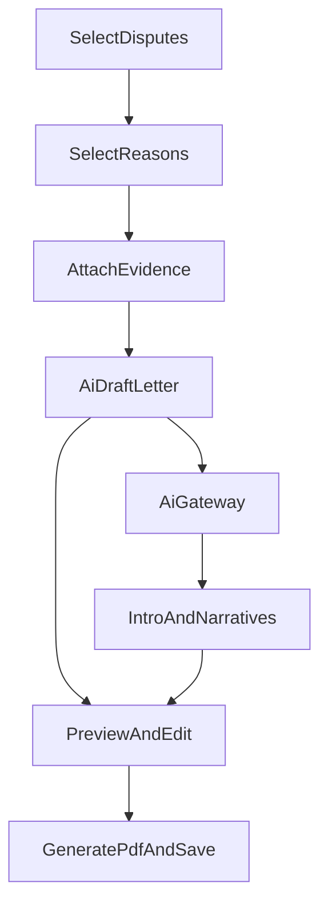

## What’s happening now

- The “AI draft” feature still exists, but it only drafts **template bodies** inside `[src/components/templates/TemplatesVaultPanel.tsx](src/components/templates/TemplatesVaultPanel.tsx)`.
- In the actual letter workflow, `[src/components/letters/LettersCommandCenter.tsx](src/components/letters/LettersCommandCenter.tsx)` generates bureau PDFs using a fixed structure in `[src/letters/generateDisputePdfInline.ts](src/letters/generateDisputePdfInline.ts)` and only allows editing the Opening paragraphs.
- The screenshot attachment issue is likely **reactivity**: local storage writes emit `finely:store`, but `LettersCommandCenter` doesn’t listen for that event. So evidence captured/uploaded elsewhere can look “not attached / missing” until a refresh.

## Goals (per your request)

- Add **AI Draft Letter** back into the bureau dispute flow, producing a **fuller bureau letter** draft (intro + per-item narratives) after negatives/reasons are selected.
- Support **both** flows: bureau disputes + debt/legal letters.
- Gate AI drafting as **Premium (top tiers)**, but allow **Admin override** (pilot).
- Fix screenshot selection/attach UX so choosing an image reliably reflects as “linked” and shows in preview.

## Premium + admin gating approach

- Add a small helper (new module) that answers: `canUseAiDraft({ partnerId, isAdminContext })`.
  - **Admin context**: always allowed.
  - **Premium context**: allowed if partner has any of these entitlement keys (defaults):
    - Personal: `personal_restore`, `personal_platinum` (and any higher tier keys if present)
    - Debt/legal: `debt_kill_pro`, `debt_kill_plus`, `debt_kill_premium`, `debt_kill_high_balance`, `debt_kill_institutional`, `debt_kill_enterprise`
  - Implement using existing `hasEntitlement(partnerId, key)` from `[src/data/billingRepo.ts](src/data/billingRepo.ts)`.

## Bureau dispute AI drafting design

- Add new state in `LettersCommandCenter`:
  - `aiIntroByBureau: Record<Bureau,string>` (HTML) or reuse `introByBureau`
  - `aiNarrativeByCandidateKey: Record<string,string>` keyed by `SelectedDispute.key`
- Add an “AI Draft Letter” action per bureau letter card (near the paper preview / generate button).
- AI call:
  - Use `[src/lib/aiClient.ts](src/lib/aiClient.ts)` (`callAiGateway`) with `responseFormat: 'json'`.
  - Provide context: bureau, tone, round, list of selected items (account, type, reasons), and a safe “don’t hallucinate” instruction.
  - Expected JSON shape:

```ts
{
  "intro": "plain text or html",
  "items": [{ "key": "<SelectedDispute.key>", "narrative": "..." }],
  "questions": ["If missing facts, ask these"]
}
```

- Apply the result:
  - Replace `introByBureau[bureau]` with AI intro.
  - Store `aiNarrativeByCandidateKey[key]` per item.
  - If `questions` are returned, show a small “AI needs these answers” panel (optional v1; can be a simple list).

## Rendering the “full” draft into PDF + preview

- Extend `[src/letters/generateDisputePdfInline.ts](src/letters/generateDisputePdfInline.ts)`:
  - Update `DisputeLetterItem` to include `narrative?: string | null`.
  - In PDF generation, after “Dispute reasons” (or before), render:
    - `AI Narrative:` block when present.
- Extend the on-screen preview component inside `LettersCommandCenter` (`DisputeLetterPaperPreview`) to also display the narrative block for each item.

## Debt/legal AI drafting

- In the debt draft modal section of `LettersCommandCenter`, add an “AI Draft” button that:
  - Uses `callAiGateway` with context (scenario, selected `DebtLetterSpec`, debt fields like creditor/plaintiff, state/jurisdiction if present).
  - Returns text (or HTML) that replaces the `draft.html` editor content.
  - Still allows templates insertion; AI draft is an accelerator.

## Fix screenshot attach not reflecting

- In `[src/components/letters/LettersCommandCenter.tsx](src/components/letters/LettersCommandCenter.tsx)` add a `window.addEventListener('finely:store', ...)` listener.
  - When `detail.key` matches evidence storage key (`finely.evidence.v1`), bump `evidenceVersion` so `listEvidenceByPartner()` is re-read.
  - This makes new screenshots captured in Reports/Credit Intel immediately appear and attach correctly without refresh.

## Safety/UX

- If AI Gateway is disabled or Supabase isn’t configured, show a clear inline error and keep manual templates available.
- Keep “not legal advice” language; do not force hard-coded citations unless they exist in our curated legal modules.

## Files likely to change

- `[src/components/letters/LettersCommandCenter.tsx](src/components/letters/LettersCommandCenter.tsx)`
- `[src/letters/generateDisputePdfInline.ts](src/letters/generateDisputePdfInline.ts)`
- New: `src/billing/aiDraftAccess.ts` (or similar helper)




