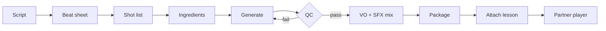
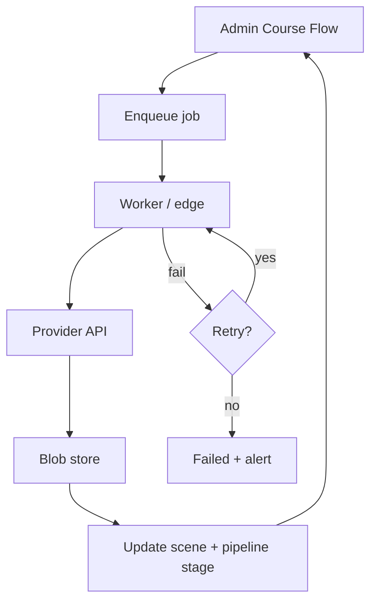
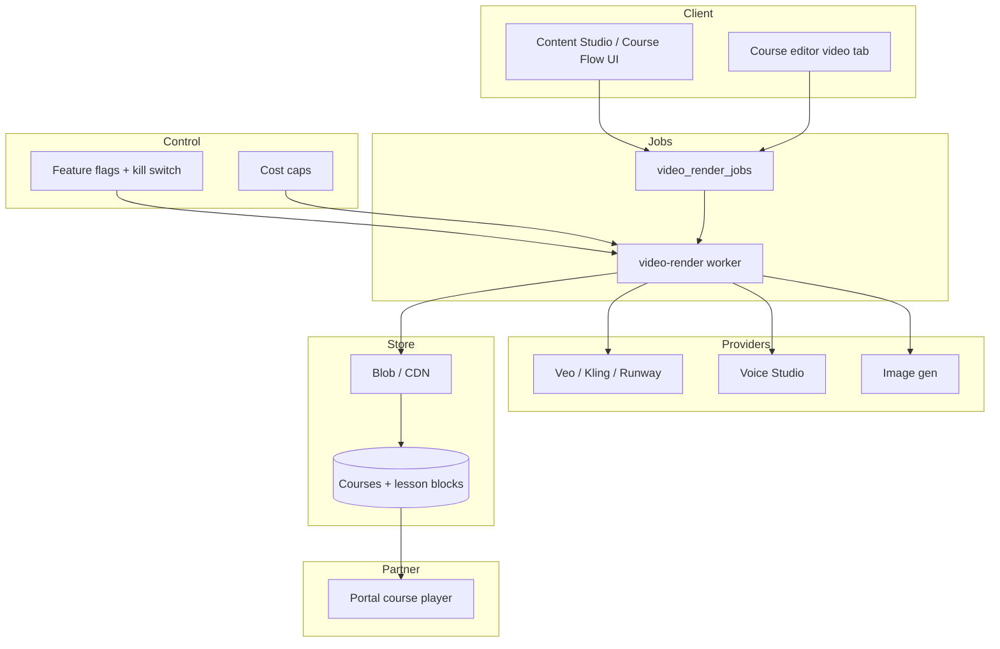

# Finely Course Flow — Maximum Plan (Master)

**Status:** Planning bible — implementation only where noted under “Layout pass”  
**Canonical path:** `docs/PLAN_VIDEO_COURSE_MAXIMUM.md`  
**Supersedes:** `docs/PLAN_VIDEO_COURSE_VS_GOOGLE_FLOW.md` (keep as pointer + short exec summary)  
**Date:** 2026-07-24 · **Audience:** Owner + developer  
**North star:** Beat Google Flow for **course video** (curriculum → branded lesson media → partner LMS), not as a generic filmmaker sandbox.

---

## 0. Verdict (one screen)

| Claim | Truth today |
|-------|-------------|
| Matches Google Flow cinematic gen | **No** — Kling / Runway / Veo / Luma / Pika are **stubs**; Content Studio **blocks** them |
| Live render path | Stills + captions + Voice Studio TTS → browser **WebM**; Tour Factory ffmpeg CLI for site tours |
| Course / LMS OS | **Ahead of Flow** — modules, lessons, blocks, batch factory UI, partner player |
| Honest marketing “prompt-to-video like Flow” | **Overstated** until one live motion provider returns playable media |

**Minimum for honest course-video parity:** one live motion adapter + brand Ingredients + server job queue + VO mix + attach → partner play.  
**Exceed Flow for courses:** batch curriculum factory, brand VO, Remotion lesson chrome, compliance, partner LMS — Flow cannot do this natively.

**Layout pass started (2026-07-24):** Admin course-video surfaces refactored from long lists → deck tiles + stage rails + focused detail panels (`CourseVideoBatchWorkroom`, `CourseVideoProductionCommand`, `VideoProductionPanel`, `GeminiStyleVideoCommand` storyboard, `VideoStudioPremiumShell`). Provider readiness UI no longer greens Kling/Runway on key-detect alone. Generative motion adapters remain stubs.

---

## 1. Audit truth (inventory snapshot)

### 1.1 Live vs stub

| Capability | Status | Path |
|------------|--------|------|
| AI course outline / scene plans | Live (AI gateway) | `educationStudioPipeline.ts` (`education.full_course`, `education.video_scenes`) |
| Scene stills | Live (gated `videoStudio`) | `imageGenClient.ts`, `image-generate` |
| TTS / VO | Live | `voice-studio`, Cartesia / ElevenLabs |
| Browser WebM stitch | Live | `mediaExport.ts` |
| Tour MP4 (ffmpeg CLI) | Live CLI | `scripts/tour-assemble.ts`, `docs/TOUR-FACTORY.md` |
| Kling / Runway / Veo / Pika / Luma | **Stub** | `videoProviders/index.ts` → `status: 'queued'` only |
| HeyGen / Synthesia / Tavus / Canva | **Blocked** | `contentStudioProviders.ts` |
| Remotion / Shotstack | **Absent** | not in `package.json` |
| `premium-media-generate` | Plan JSON only | `supabase/functions/premium-media-generate` |

### 1.2 Routes

| Route | Role |
|-------|------|
| `/admin/content-studio` | Media / Content Studio OS |
| `?room=video\|course_videos\|voice\|…` | Workrooms |
| `/admin/courses`, `/admin/courses/:id` | Catalog + editor (`video` tab) |
| `/admin/voice-studio`, `/admin/tour-studio` | VO + Tour Factory |
| `/admin/resources` | Uploaded MP4/WebM library |
| `/portal/courses`, `/portal/courses/:id` | Partner LMS consume |
| `/portal/video/:callId` | Live meetings — **not** AI gen |

### 1.3 Feature flag / env (truth)

| Key | Role | Reality |
|-----|------|---------|
| `features.videoStudio` | Gates Media Studio image tools | Settings + `adminFeatureMatrix` |
| `VITE_KLING_API_KEY` / `VITE_RUNWAY_API_KEY` | Readiness UI only | **Does not call APIs**; misleading “ready” |
| `CARTESIA_*` / `ELEVENLABS_*` | Voice Studio secrets | Real edge usage |
| Proposed: `videoStudioCinematic` | Separate cinematic flag | **Not built** |

### 1.4 Persistence risk

Courses / pipeline jobs mostly `localJsonStore` (`finely.courses.v1`, `finely.courseVideoPipeline.v1`). Blobs via `getBlobStore()` (Supabase + IndexedDB fallback). Production multi-admin needs cloud course sync (Phase 2).

**Full file index:** Appendix A.

---

## 2. Product vision — “Finely Course Flow”

### Admin author journey

1. Prompt → AI course (modules/lessons)  
2. Per lesson: script → beat sheet → shot list  
3. Apply Brand Ingredients pack  
4. Generate motion (future) or Presenter Mode (stills+VO today)  
5. QC gate → VO/SFX mix → Remotion/ffmpeg package  
6. Attach `video_asset` → publish checklist → partner unlock  

### Partner learner journey

Open course → one lesson video → captions on → next lesson / quiz / CTA “Book a session”. No creator studio. No list dump of assets.

### Cinematic quality bar (education)

Premium Finely look, readable on-screen teaching text, brand VO primary, calm pacing for credit/dispute/litigation explainers, compliance end-card. Not TikTok chaos.

---

## 3. UX Layout System (anti-list) — REQUIRED

### 3.1 Forbidden (primary UI)

- Endless scroll tables of scenes / lessons / jobs  
- Vertical walls of full-width scene cards with entire prompts always open  
- Duplicate KPI strips + stacked banners  
- Tall nested `overflow-y-auto` panes as the main navigation  

### 3.2 Required patterns

| Pattern | Use |
|---------|-----|
| **KPI strip** | Counts: lessons, storyboarded, rendered, attached, $ estimate |
| **Stage rail** | `draft → script → storyboard → render → attach → publish` (chips, not a table) |
| **Deck / storyboard grid** | 2–4 col scene/shot tiles; title + duration + status only |
| **Focused detail panel** | One selected shot/lesson; full prompt/VO/controls here |
| **Paginated stacks** | `FinelyOsPaginatedStack` / catalog browser when ≥20 items |
| **Collapsible groups** | Module groups as `<details>`, not open walls |
| **Single composition / viewport** | Brand signal + where am I + what matters + one primary CTA |

### 3.3 Wireframe — Admin Course Flow (one viewport)

```text
┌─────────────────────────────────────────────────────────────┐
│ Finely Course Flow · [Course title]     [Presenter|Cinematic]│
│ KPI: 12 lessons · 8 storyboard · 3 attached · est $__       │
│ Rail: Draft · Script · Storyboard · ●Render · Attach · Pub  │
├──────────────────────┬──────────────────────────────────────┤
│ STORYBOARD BOARD     │ FOCUS PANEL                          │
│ ┌────┐ ┌────┐ ┌────┐ │ Shot 03 · Hook                       │
│ │S1  │ │S2● │ │S3  │ │ Preview / still                      │
│ └────┘ └────┘ └────┘ │ Visual · VO · camera (collapsed)     │
│ [page 1/2]           │ [Approve] [Regenerate] [Mix VO]      │
│                      │ Primary CTA: Render selected / lesson │
└──────────────────────┴──────────────────────────────────────┘
```

Tokens: `FINELY_OS_COMPACT_PAGE`, `finelyOsDeckTile`, `finelyOsGlowKpi`, `FINELY_OS_PRIMARY_BTN` (one amber CTA).

### 3.4 Wireframe — Partner player

```text
┌──────────────────────────────────────┐
│ Lesson title · Module 2 of 6         │
│ ┌──────────────────────────────────┐ │
│ │         VIDEO PLAYER             │ │
│ └──────────────────────────────────┘ │
│ Captions · Progress · Next lesson    │
│ Disclaimer strip (compliance)        │
└──────────────────────────────────────┘
```

No asset library dump. No scene list for partners.

### 3.5 Layout pass status

| Surface | Before | After (started) |
|---------|--------|-----------------|
| Course video batch workroom | Paginated **list rows** | Deck tiles + stage KPIs + focus command |
| Course editor video command | Lesson **list rows** | Lesson deck + stage rail + focus |
| Video production panel | Scene **inline list** | Storyboard grid + selected scene detail |
| Gemini video command scenes | Vertical **scene wall** | Board grid + selected beat detail |
| Video shell “quality” | Checklist wall + overstated ready | Compact pipeline cards + honest Planned/Live |

---

## 4. Shot-level course pipeline

| Step | Inputs | Outputs | Human gate |
|------|--------|---------|------------|
| 1 Script | Lesson markdown, objectives | Narration script | Approve / edit |
| 2 Beat sheet | Script | Beats (hook→teach→proof→CTA) | Approve pacing |
| 3 Shot list | Beats | `VideoScenePlan[]` (prompt, camera, duration, VO) | Approve shots |
| 4 Ingredients | Brand pack + refs | Locked style + refs per job | Lock pack for course |
| 5 Generate | Shot + ingredients | Clip/still URL | Auto-retry then human QC |
| 6 QC | Rubric scores | Pass / fail / regen | **Required** before mix |
| 7 Mix | Clips + Voice Studio + SFX | Master A/V | Spot-check loudness |
| 8 Package | Remotion/ffmpeg | MP4 + captions + end-card | Publish checklist |
| 9 Attach | Blob + lesson id | `video_asset` block | Confirm in preview |
| 10 Partner play | Entitlement | Playback + progress | Partner feedback |



---

## 5. Quality bar (measurable)

| Dimension | Target for courses | “Higher than Flow” means |
|-----------|--------------------|---------------------------|
| Resolution | 1080p lesson default | Packaged education chrome + LMS |
| Motion | Coherent 4–8s shots; no morph faces on host | Continuous brand host across 10 lessons |
| Lip-sync | Prefer **VO over B-roll**; avatar only if approved | Brand Voice Studio > Veo dialogue |
| Brand match | Palette, logo safe area, typography overlays | Ingredients pack reused course-wide |
| Pacing | ≤ ~140 wpm VO; 1 teaching idea / shot | Curriculum-aware batch, not clip sandbox |
| Captions | Always-on option; WCAG contrast | Burned + side-car VTT |
| Compliance | End-card disclaimer every lesson | Flow has none |
| Continuity | Last-frame → next I2V (Phase 2) | Flow Extend-like for lessons |

**QC rubric (pass ≥ 4/5):** brand match · readability · pacing · compliance · technical (no freeze/glitch).

**Genre notes:** Dispute how-tos = calm UI/B-roll; litigation explainers = no fake courtroom drama; funding = never promise approval.

---

## 6. Ingredients / prompt system

**Brand bible pack (v0 JSON → v1 uploads):** logo variants, palette, “Finely Cred look” positive + negative prompts, presenter stills (optional), classroom/set refs, logo safe areas, disclaimer end-card template (video chrome only — never inside mailed letters).

**Style locks across 10-lesson course:** same Ingredients id on every job; same VO persona; same lower-third template; negative prompts for “stock handshake spam”, “guaranteed score”, “delete all negatives”.

**Prompt layers:** System brand lock → lesson pedagogy → shot visual → camera → compliance.

---

## 7. Multi-provider orchestration

| Lane | When | Notes |
|------|------|-------|
| **Presenter Mode** (stills+VO+WebM) | Default until cinematic flag green | Honest, cheap, shippable |
| **Veo** (Vertex/Gemini) | Primary cinematic if owner picks Flow-match | Prefer video-only + Finely VO (cost) |
| **Kling** | Cost / longer motion alternate | Env anticipated; stub today |
| **Runway** | Style / motion brush alternate | Stub today |
| **HeyGen/Tavus** | Optional talking-head modules | Phase 2; ToS + cost |
| **ffmpeg / Remotion** | Always for package | Tours pattern → lesson package |

**Routers:** quality (hero lessons → Veo Standard/Fast) · cost (draft → Lite / Presenter) · failover (provider fail → Presenter) · A/B (still vs motion completion).

**Never:** `VITE_*` paid gen keys in production client.

---

## 8. Job system spec (draft)

**Table `video_render_jobs` (proposed):**  
`id, course_id, lesson_id, scene_id, provider, status, attempt, cost_cents_est, cost_cents_actual, output_blob_ref, error, created_by, created_at, updated_at`

Statuses: `queued → processing → completed | failed | cancelled`.

| Concern | Spec |
|---------|------|
| Queue | Edge `video-render` + poll or webhook |
| Retries | 2 automatic; then human |
| Cancel | Admin cancel → provider cancel if supported |
| Cost caps | Per course + monthly hard stop |
| Progress UI | KPI + per-shot status on deck tiles |
| Kill switch | `videoStudioCinematic=false` + admin halt |



---

## 9. Storage & CDN

| State | Behavior |
|-------|----------|
| Draft | Private bucket; admin/staff only |
| Published | Signed URL / CDN; partner entitlement check |
| Versioning | `v1, v2…` keep last N; purge drafts after TTL |
| Entitlement | Portal course enrollment required |
| PII | Never embed partner names/SSN/report text in gen prompts |

---

## 10. Voice + music + SFX

| Layer | Source | Rule |
|-------|--------|------|
| Narration | Voice Studio (Cartesia preferred) | Brand voice wins over native Veo dialogue for lessons |
| Music | Licensed beds only | No random YouTube rips |
| SFX | `soundEffectsCatalog` | Duck under VO (−12 to −18 LUFS relative) |
| Loudness | Target ~−16 LUFS integrated education | Spot-check |
| Risk | Unlicensed music = legal exposure | Prefer catalog / silent + SFX |

---

## 11. Remotion / ffmpeg compositions (Phase 2 list)

1. Lesson title card (course · module · lesson)  
2. Lower-thirds (key term)  
3. Chapter markers / progress ticks  
4. Compliance end-card  
5. Next-lesson bumper + “Book a session”  
6. Caption burn-in option  
7. Module bumper (optional)  

Phase 1: ffmpeg concat + VO mix (extend `tour-assemble` patterns). Remotion for chrome after live motion exists.

---

## 12. Admin UX flows (step-by-step)

1. **Pick course** (select, not a 50-row table)  
2. **Stage rail KPI** — see blockers  
3. **Lesson deck** — click one tile  
4. **Focus panel** — script / storyboard / render  
5. **Storyboard board** — select shot → edit in focus  
6. **Render** — Presenter now / Cinematic when flagged  
7. **QC modal** — pass/fail  
8. **Attach + preview** in partner player chrome  
9. **Publish checklist**  

Partner: play → captions → complete → next. Simple.

---

## 13. Security / ToS / PII

- **Never** send partner PII, credit reports, case numbers, or letter bodies to third-party video APIs.  
- Redact: names, addresses, SSN/ITIN, account numbers, full report OCR.  
- Use generic education scripts (“a partner”, “an Equifax entry”) for gen.  
- Commercial ToS: verify Veo/Kling/Runway/HeyGen allow education + paid partner content.  
- Watermark / SynthID policy: keep provider marks unless license allows strip; disclose AI-assisted media.  
- Secrets: server-only; rotate; cost alerts.

---

## 14. Budget scenarios (estimates — label clearly)

Assumptions: ~8 scenes × 6s = ~48s motion / lesson; Finely VO separate (~$0.02–0.10/min). Veo Fast ~$0.10–0.12/s with audio; video-only often ~50% less on Vertex. Presenter Mode ≈ $0–$2/lesson (images+TTS).

| Scenario | Quality | Ballpark |
|----------|---------|----------|
| 1 course × 10 lessons | Presenter | **$20–80** |
| 1 course × 10 lessons | Cinematic Lite/Fast | **$150–600** |
| 1 course × 10 lessons | Veo Standard | **$800–2,500+** |
| 10 courses / month (mix 70% Presenter / 30% Fast) | Mixed | **$500–3,000** |
| Heavy cinematic month | Mostly Standard | **$5k–15k+** |

Owner must set **monthly ceiling** + per-course cap before Phase 1.

---

## 15. Google Flow capability matrix (deep)

| Capability | Flow | Finely today | Course fitness |
|------------|------|--------------|----------------|
| Text→video | Veo live | Stub | Critical gap |
| Image→video | First-class | Stills→WebM | Critical |
| Ingredients | Up to ~3 refs | Style prompts only | High |
| Frames / Extend / SceneBuilder | First-class | Scene list only | High for film; Medium for lessons |
| Camera | Prompt + controls | `cameraDirection` field | Map in Phase 1 |
| Native A/V | Yes | Separate TTS | Prefer Finely VO |
| Upscale / 4K | Ultra tier | No | Optional marketing |
| LMS / batch / compliance | No | Yes | Finely exceed |

---

## 16. Competitor / provider landscape (course OS)

| Provider | Pros for Finely | Cons | Cost band | Latency | ToS note |
|----------|-----------------|------|-----------|---------|----------|
| Veo | Closest to Flow quality | Cost; clip length | $/sec | Minutes/job | Enterprise via Vertex preferred |
| Kling | Motion value | Consistency varies | Mid | Mid | Confirm commercial |
| Runway | Creative controls | Credits opaque | Mid–high | Mid | Pro+ for commercial |
| Luma / Pika | Fast drafts | Less education polish | Low–mid | Fast | Check rights |
| HeyGen / Synthesia | Talking head | Uncanny + cost | High/min | Mid | Avatar likeness rights |
| Remotion | Brand chrome | Dev effort | Eng time | Render farm | Self-hosted |
| ffmpeg | Stitch/mix proven | Not generative | Infra | Fast | OK |
| ElevenLabs / Cartesia | Already wired | Not video | Per char/min | Fast | Existing |

---

## 17. Phases (acceptance · effort · deps · risks · rollback)

### Phase 0 — Trust + Presenter + layout (S) — **recommended start**

| | |
|--|--|
| **Do** | Honest Planned/Live badges; name WebM path “Presenter Mode”; brand prompt pack v0; anti-list layout pass; cost sheet; deep-link QA |
| **Accept** | UI never claims live Kling/Runway/Veo without playable output; course video UI is deck+rail+focus |
| **Deps** | None |
| **Risk** | Low |
| **Rollback** | Revert copy/layout |

### Phase 1 — Course parity (L)

One live provider adapter + `video_render_jobs` + server secrets + Ingredients v1 + VO mix + batch progress + cost meter.  
**Accept:** One lesson motion MP4 + Finely VO attached; partner plays on mobile/desktop.  
**Rollback:** Flag off → Presenter Mode.

### Phase 2 — Exceed (L)

Remotion chrome, continuity I2V, multi-provider router, optional avatar, cloud course sync, Finely prompt library, analytics.  
**Accept:** Batch time < manual Flow assemble for same script; brand consistency rubric pass across 3+ lessons.

### Phase 3 — Scale (M–L)

CDN hardening, auto cost routing, watch-through regen, upscale for heroes only.

---

## 18. 90-day calendar (week-by-week)

| Week | Focus |
|------|--------|
| 1 | Phase 0 honesty + layout pass complete; owner picks provider + budget |
| 2 | Brand Ingredients v0; Presenter Mode polish; sample 3 lessons |
| 3 | Job table design + edge skeleton (no spend) |
| 4–5 | Adapter #1 (Veo **or** Kling/Runway) sandbox |
| 6 | VO mix + attach path e2e |
| 7 | Batch workroom real jobs + cost caps |
| 8 | QC rubric + 3 genre pilots |
| 9–10 | Remotion title/end-card; continuity spike |
| 11 | Cloud sync spike for courses |
| 12 | Owner demo gate: parity checklist green or Presenter-only launch |

---

## 19. Parity vs Exceed checklist

**Matches Flow (courses):** playable motion from plan · Ingredients reused · VO mixed · attach · partner play · honest UI · cost visible.  
**Beats Flow for courses:** batch factory · brand Voice Studio · LMS progress/certs · compliance end-cards · Remotion chrome · Presenter failover · no partner PII in gen APIs.

---

## 20. Anti-goals (do not build)

- Full Flow SceneBuilder clone before one live provider  
- Partner-facing generative playground  
- Shipping `VITE_` paid keys  
- Avatar lane before cinematic B-roll works  
- 4K every lesson  
- Putting dispute letter bodies into video prompts  
- Fake green “ready” for stub providers  
- Roosevelt automation in this track  

---

## 21. Developer deploy runbook (Phase 1+)

1. Feature flags: `videoStudio` (existing), `videoStudioCinematic` (new)  
2. Secrets (server): Vertex/Gemini **or** Kling **or** Runway — never Vite  
3. Keep `CARTESIA_API_KEY` / `ELEVENLABS_API_KEY`  
4. Migrate `video_render_jobs` + RLS admin/staff  
5. Bucket lifecycle draft→published  
6. Monthly budget alert  
7. Kill switch runbook  

---

## 22. Open questions for owner (decisions)

1. Primary cinematic provider: Veo vs Kling vs Runway?  
2. Monthly spend ceiling?  
3. Per-course cap?  
4. Presenter-only launch OK until Phase 1?  
5. Avatar lane yes/no/later?  
6. Host character: real talent stills vs abstract brand?  
7. Default aspect 16:9 lessons vs dual cutdowns?  
8. Captions burned-in vs player-only?  
9. Cloud course sync priority vs gen video?  
10. Which 3 pilot courses first?  
11. Accept SynthID/watermarks?  
12. Who approves QC (owner vs staff role)?  
13. Music licensing budget?  
14. Vertex billing account ready?  
15. Remotion in-house vs contractor?  
16. Partner trailer auto-cut from lesson 1?  
17. Dispute/litigation visual tone guidelines sign-off?  
18. Soft vs hard kill at cost cap?  
19. Multi-tenant white-label later?  
20. Marketing claim freeze until Phase 1 green?

---

## 23. Architecture (target)



---

## 24. Data models (draft — not implemented)

```ts
// brand_ingredients_packs
{ id, name, logoRefs[], palette, negativePrompt, presenterRefs[], locked: boolean }

// video_shots extends VideoScenePlan
{ beatId, ingredientPackId, startFrameRef?, endFrameRef?, qcScore?, outputBlobRef? }

// video_render_jobs — see §8

// lesson_video_masters
{ lessonId, version, masterBlobRef, captionVttRef, status: 'draft'|'published' }
```

Existing keep: `VideoScenePlan`, `CourseLessonVideoJob` stages, `video_asset` block.

---

## Appendix A — Key files (developer)

| Concern | Path |
|---------|------|
| Stub adapters | `src/features/educationStudio/videoProviders/index.ts` |
| Provider blocked | `src/features/studioCommandOs/contentStudioProviders.ts` |
| Readiness UI | `src/lib/videoProviderRenderPlan.ts` |
| Scene model | `src/domain/educationStudio.ts` |
| WebM | `src/lib/mediaExport.ts` |
| Batch factory | `src/features/studioCommandOs/CourseVideoBatchWorkroom.tsx` |
| Course video UI | `src/features/educationStudio/CourseVideoProductionCommand.tsx` |
| Scene panel | `src/features/educationStudio/VideoProductionPanel.tsx` |
| Create command | `src/features/studioCommandOs/GeminiStyleVideoCommand.tsx` |
| Video shell | `src/features/studioCommandOs/VideoStudioPremiumShell.tsx` |
| Voice | `docs/VOICE_STUDIO_API.md`, `supabase/functions/voice-studio` |
| Master checklist | `docs/MASTER_EXECUTION_PLAN.md` Phase 21 |
| Tours ffmpeg | `docs/TOUR-FACTORY.md` |

## Appendix B — Roosevelt (no build)

Manual deploy only. Sync/enrichment later. See `_import_roosevelt/`. Out of scope for Course Flow.

---

*Master planning document. Layout pass may update UI files; generative providers remain stubs until Phase 1.*
