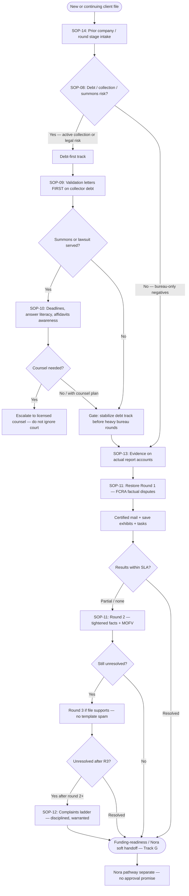

# Workflow map — Finely restore methodology

High-level sequencing for specialists. Always reconcile with the **live file** (prior letters, summons status, round stage).

## Mermaid (primary)



## ASCII (fallback)

```
                    ┌─────────────────────┐
                    │ Intake + round stage │
                    │      (SOP-14)        │
                    └──────────┬──────────┘
                               v
                    ┌─────────────────────┐
                    │   Debt triage       │
                    │      (SOP-08)       │
                    └──────────┬──────────┘
              risk │                    │ bureau-only
                   v                    v
         ┌─────────────────┐    ┌─────────────────┐
         │ Validation FIRST │    │ Evidence pack   │
         │    (SOP-09)      │    │   (SOP-13)      │
         └────────┬─────────┘    └────────┬────────┘
                  v                       │
         ┌─────────────────┐              │
         │ Summons fork?   │              │
         │   (SOP-10)      │              │
         └────────┬─────────┘              │
           yes    │    no                  │
                  v    └──────────────────┘
         ┌─────────────────┐              v
         │ Court literacy  │    ┌─────────────────┐
         │ + counsel path  │    │ Restore rounds  │
         └────────┬────────┘    │ R1 → R2 → R3    │
                  │             │    (SOP-11)       │
                  └─────────────┤                   │
                                └────────┬──────────┘
                                         v
                              ┌─────────────────┐
                              │ Complaints fork │
                              │  (SOP-12)       │
                              │ after failed    │
                              │ rounds when     │
                              │ warranted       │
                              └────────┬────────┘
                                         v
                              ┌─────────────────┐
                              │ Funding-readiness│
                              │ Nora soft handoff│
                              └─────────────────┘
```

## Fork rules (memorize)

| Fork | Rule |
| --- | --- |
| Debt vs restore | If collection activity or summons risk exists, **do not** blindly start Round 1 bureau templates while ignoring collector track. |
| Validation | On collector debt, validation **before** assuming bureau-only dispute will protect the client. |
| Summons | **Never** “ignore court.” Document dates; escalate to counsel when stakes exceed trainee scope. |
| Complaints | Consider **after** failed rounds (often post–Round 2), with a clean file — not revenge spam. |
| OCR | Vary structure; no cookie-cutter walls of identical paragraphs across accounts. |
| Prior company | Discover what was already mailed; **never** restart Round 1 blindly (SOP-14). |

---

*Educational only. Not legal advice. No guaranteed deletions, scores, or loan approvals. Debt may remain after restore. Nora funding is separate; no approval promised.*
